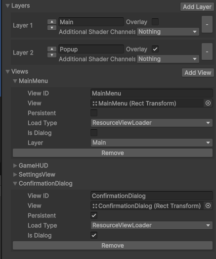
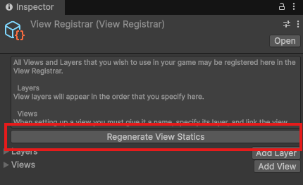
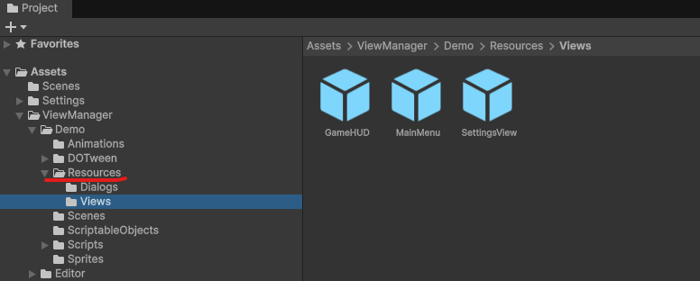

[](https://github.com/jonHuffman/ViewManager)
[](https://github.com/jonHuffman/ViewManager/blob/master/LICENSE)
[](https://github.com/jonHuffman/ViewManager/raw/master/UnityPackage/ViewManager_v1.3.unitypackage)

# ViewManager

A manager for the UI lifecycle within Unity applications, ViewManager makes it easy to add and remove UI prefabs while
maintaining strict separation between UI and system code.

Originally written and maintained for private use I have decided to make it public in hopes that other game developers
will find it useful.

## What it Does

## How to Use

Though ultimately simple to use, the View Manager requires some setup before you can start invoking your UI. Typically
the majority of the work is in the creation of your UI prefabs, these are your Views. Once your View exists you must
link it in an library asset called a Registrar. Finally, you must call initialize on the View Manager system and provide
a couple of dependancies (including a registrar). Once this is done iterating and adding new views becomes a quick
process.

### 1. Create Registrar

`From menu: Tools / View Manager / Create Registrar`

### 2. Add Layers & Views to Registrar

Reference Prefabs to Registrar. Manager can load and instatite.
> ⚠️ When re-location any view, please re-reference it.



### 3. Create Layers & Views Statics

Click `Generate View Statics` to use View/Layer id.



```csharp
using Nope.ViewManager;
View.MainMenu
```

### 4. Initialization

Call `ViewManager.Instantiate(viewCanvas, registrar);` before call any methods.

### 5. Adding a View

```csharp
ViewManager.Instance.AddView(View.MainMenu);
```

Or you can add view with Spec Data

```
ViewManager.Instance.AddView(View.ConfirmationDialog, new ConfirmationDialog.ConfirmationDialogData(ApplicationQuit));
```

## How to create a View

- All views must inherit from `BaseView` class.
- Prefab has been ref to `Registar` must locate in path has "Resources".
 

### Passing custom Data when adding a View
- Implement `IViewDataReceiver<T>` to View class.
- `T` is data of View, must inherit from `IViewData`
```csharp
class ViewA : IViewDataReceiver<ViewAData>

class ViewAData : IViewData<ViewAData>
```
